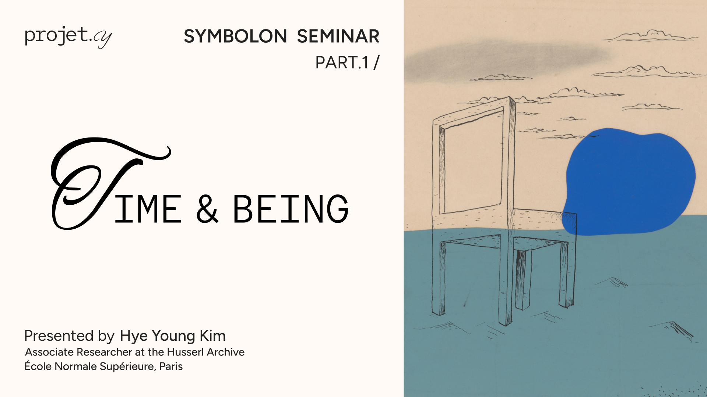

# Symbolon #1 – Heidegger’s *Being and Time*

## 🎥 Recording

## 🔹 Summary

The seminar introduces the Symbolon project, a philosophical and interdisciplinary initiative exploring AI, society, and metaphysical questions. This session, led by Hyong, focuses on Heidegger’s *Being and Time* (1927), centering on the concept of **Dasein** — the human being that questions its own being. Through Dasein, Heidegger explores **temporality**, **authenticity**, **death**, **care (Sorge)**, and **understanding** as existential structures rather than psychological or cognitive categories.

The analysis follows how temporality structures human existence as a tension between the **past (having-been)**, **future (possibility, especially death)**, and **present (being-here-now)**. The concept of **care** becomes central to this structure — not as a feeling, but as the existential mode by which humans engage with being.

Hyong supplements Heidegger’s framework by linking **temporality to storytelling**, proposing that narrating one's existence (even inwardly) provides a phenomenological bridge between individual existence and intersubjective understanding, potentially avoiding solipsism.

## 🧭 Timeline of Key Concepts and Questions

| Phase                    | Key Concept or Question Explored                                                                      |
|--------------------------|--------------------------------------------------------------------------------------------------------|
| Opening                  | What is Symbolon? Why bring interdisciplinary voices into AI-philosophy dialogue?                      |
| Introduction to Heidegger| Who is Heidegger, and why does *Being and Time* matter?                                                |
| Dasein                   | What does it mean to be a being that questions its own being?                                          |
| Human Finitude           | How does knowing we will die structure our understanding of time and meaning?                         |
| Temporality              | What is temporality, and how is it different from measurable clock time?                              |
| Authenticity             | What does it mean to live authentically versus inauthentically?                                       |
| Death                    | Why is death the most authentic possibility of being?                                                 |
| Care (Sorge)             | What does it mean to care existentially — not just emotionally?                                       |
| Understanding            | How is understanding not cognition, but a mode of being?                                               |
| Heidegger vs. Tradition  | How does Heidegger critique modern subjectivity and offer a new vision of freedom?                    |
| Narrative/Storytelling   | Can storytelling reveal the structure of our being-in-time and help us share meaning with others?     |

## 🧾 Glossary of Key Terms

| Term                | Definition |
|---------------------|------------|
| **Dasein**          | Literally "being-there" (German); the being for whom being is a question. For Heidegger, this is the human being. |
| **Being (Sein)**    | That which determines entities as entities; the foundational philosophical question in Heidegger's work. |
| **Temporality (Zeitlichkeit)** | The structure of time as it is lived by Dasein: having-been (past), walking-ahead (future), and the now. |
| **Thrownness (Geworfenheit)** | The fact that we find ourselves already in a world not of our choosing; a fundamental condition of Dasein. |
| **Care (Sorge)**     | The basic mode of being of Dasein; how we relate to our own being and the world. Not emotion, but existential structure. |
| **Authenticity / Inauthenticity** | Ways of being: authenticity involves owning one’s potential and finitude; inauthenticity means being absorbed in "the they" (das Man). |
| **Anxiety (Angst)** | A state (not a feeling) where Dasein faces the nothingness of its being, especially death. |
| **Understanding (Verstehen)** | Not cognition, but an existential mode through which Dasein projects possibilities of being. |
| **The They (das Man)** | The anonymous collective through which inauthentic existence manifests — living as everyone else lives. |
| **Freedom toward death** | The existential stance of recognizing death as the ultimate possibility and orienting oneself authentically toward it. |
| **Throne projection (Geworfen Entwurf)** | A compound existential structure: we are thrown into existence but project ourselves forward through choice and understanding. |
| **Narrative / Storytelling** | (As interpreted by the speaker) A way of making temporality and existence intelligible, linking personal and shared experience. |

## 📚 Bibliography & Works Cited

- **Martin Heidegger**, *Being and Time* (Sein und Zeit), 1927.  
  Heidegger's foundational work in existential ontology, exploring Dasein, temporality, authenticity, and care.

- **Hye Yong Kim**, *Sorge und Geschichte* 
  Phänomenologische Untersuchung im Anschluss an Heidegger.

- **Edmund Husserl**, *Lectures on the Phenomenology of Internal Time-Consciousness*.  
  Husserl’s analysis of time consciousness through memory and retention, a major influence on Heidegger.

- **G.W.F. Hegel**, *Phenomenology of Spirit* and the notion of “becoming” (Werden).  
  Referenced indirectly in the discussion on emergence, history, and temporality.

- **Hans-Georg Gadamer**, *Truth and Method*.  
  A student of Heidegger who interpreted *Being and Time* through the lens of understanding (Verstehen).

- **René Descartes**, *Meditations on First Philosophy*.  
  Referenced in critique of subjectivity and the cogito (“I think, therefore I am”).

- **Immanuel Kant**, *Critique of Pure Reason*.  
  Background reference in contrast to Heidegger's rejection of traditional metaphysics.

- **German Idealism** (Fichte, Schelling, Hegel)  
  Referenced as part of the tradition Heidegger aims to reframe or move beyond.
